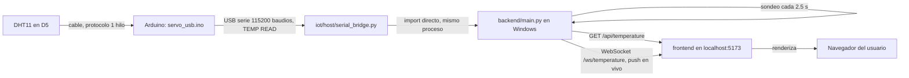
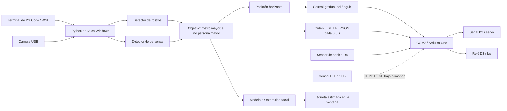

# Cámara USB, detección de rostros y personas, servo y luz con Arduino

Sistema local que conecta una cámara USB con modelos de visión artificial y un
Arduino Uno. Python detecta **rostros** (con estimación de expresión facial) y
**personas**, orienta un servomotor SG90 hacia el objetivo elegido y controla un
**relé de luz** por presencia y por sonido.

El repositorio vive en `/home/tucu/yo/person-tracking-camera-system` y se trabaja
desde VS Code / Ubuntu WSL. La cámara y el Arduino están conectados por USB a
**Windows**, donde se ejecutan el acceso a los dispositivos y la inferencia.
No hace falta abrir Arduino IDE para el uso diario.

- [Rostros, personas y servo](HUMAN_DETECTION.md)
- [Luz por presencia y sonido](LIGHT_CONTROL.md)
- [Arduino, sensores, cámara y visión](iot/README.md)
- [Monitor en vivo (backend/frontend)](#monitor-en-vivo-de-temperatura-y-humedad)

## Estado documentado: 14 de septiembre de 2026

Todo el sistema arranca y funciona de extremo a extremo, **salvo el sensor de
sonido**, que hoy no entrega señal. Resumen de la última sesión de verificación:

| Subsistema | Estado | Evidencia |
| --- | --- | --- |
| Lanzador `start.sh` | Correcto | Los cuatro pasos completos, `pip check` limpio |
| Servo D2 | Correcto | `SET 40 -> OK 40` durante el seguimiento |
| Relé de luz D3 | Correcto | `OK LIGHT ON` al detectar presencia |
| Detección de rostros y personas | Correcta | 301 fotogramas en 15 s: 241 con rostro, 301 con persona |
| Cámara `USB 2.0 CAMERA` | **Ausente** | Windows solo lista `HP HD Camera` y `Camo` |
| Sensor de sonido D4 | **Sin señal** | 45 s de palmadas: 0 ruidos, 0 flancos, D4 fijo en `HIGH` |
| Enlace serie COM3 | **Degradado** | 3 respuestas `ERR COMMAND` en 600 `PING` (0.5 %) |

Estas comprobaciones son de software y de protocolo. Las respuestas `OK` del
Arduino demuestran que procesó la orden, no que el eje girara ni que el foco
encendiera físicamente.

### Adición del 22 de septiembre de 2026: sensor DHT11 en D5

Se conectó un sensor DHT11 (temperatura y humedad, tres pines) al firmware
`servo_usb`. D0 y D2 se descartaron por chocar con el puerto serie y el servo;
quedó en **D5**. Verificado con `iot/diagnostics/check_temp.py`: 7 de 7 lecturas
correctas, 24 °C y 46-47 % de humedad. Comando serie nuevo: `TEMP READ`.

### Reorganización del 22 de septiembre de 2026: `iot/`, `ai/`, `backend/`, `frontend/`

El proyecto se separó en áreas independientes. `arduino/` y `perip/` ya no
existen como carpetas de nivel superior: todo el hardware vive ahora en
[`iot/`](iot/README.md) (firmware dividido por componente, puente USB,
diagnósticos y la integración de cámara/IA), los modelos de visión se movieron
a `ai/comp_vision/`, el diagrama y BOM a `docs/`, y se agregó el dashboard web
en `backend/` + `frontend/`. Detalle carpeta por carpeta en la tabla de abajo
y, para `iot/`, en su propio README.

## Ejecutar la integración

El arranque recomendado prepara las variables, verifica las dependencias e
inicia todo en una sola ejecución desde WSL:

```bash
cd /home/tucu/yo/person-tracking-camera-system
./start.sh
```

También funciona desde cualquier carpeta con la ruta completa del script.
Requiere Python 3.12 ya instalado en Windows, interoperabilidad de WSL
habilitada y el firmware USB del Arduino cargado. Crea el entorno de IA si falta
e instala las versiones requeridas cuando faltan o difieren. Comprueba además la
consistencia con `pip check`. Si todo coincide, no instala ni consulta el índice
de paquetes.

El lanzador detecta las rutas de Python, exporta `ARDUINO_WINDOWS_PYTHON` y
`CAMERA_AI_PYTHON`, activa `iot/tracking/.venv` y pasa la cámara y el puerto al
programa. Si falta el entorno de WSL, crea uno con la biblioteca estándar; la IA
y pySerial se ejecutan en el entorno de Windows.

Para cambiar la configuración predeterminada, copia `.env.example` a `.env` junto
al script y edítalo. Es opcional: por defecto usa `USB 2.0 CAMERA`, COM3 y el
sentido normal del servo. `.env` usa sintaxis de Bash y queda excluido de Git.

```bash
./start.sh --check                        # Entorno y modelos; no abre dispositivos
./start.sh --setup-only                   # Solo preparar y verificar dependencias
./start.sh --list                         # Listar cámaras de Windows
./start.sh --no-servo --seconds 10        # Cámara e IA durante diez segundos
./start.sh --face-only --reverse          # Solo rostros y servo en sentido inverso
./start.sh --no-humans --port COM3        # Comportamiento anterior: rostros y expresiones
./start.sh --port COM4 --index 0          # Elegir dispositivos explícitamente
./start.sh --light-seconds 60             # Luz encendida 60 s tras la última señal
./start.sh --sound-sensor off             # Ignorar la entrada D4 hasta reiniciar Arduino
./start.sh --headless --seconds 15        # Sin ventana; requiere --seconds
```

Las opciones de dispositivo de la línea de comandos prevalecen sobre `.env`.
`CAMERA_REVERSE=1` activa la inversión; usa `0` para el sentido normal.
`--check` verifica los modelos, pero no prueba la conexión física de los
dispositivos: esa se realiza al arrancar la aplicación.

La aplicación se ejecuta en primer plano con una ventana, no como un servicio
automático al iniciar Windows. El lanzador evita dos ejecuciones simultáneas de
`start.sh` mediante `flock`. No detiene otras aplicaciones que ocupen la cámara o
COM3 ni vuelve a cargar el firmware automáticamente.

En la ventana, los rostros aparecen en verde y las personas en azul; el texto
indica el objetivo elegido, el ángulo solicitado y el estado lógico de la luz.

| Control | Acción |
| --- | --- |
| Espacio | Pausar o reanudar el control del servo |
| Q o Esc | Cerrar la aplicación y liberar el servo |
| Cerrar la ventana | Finalizar la sesión |
| Ctrl+C en la terminal | Solicitar la parada desde WSL |

## Monitor en vivo de temperatura y humedad

Dashboard web con el DHT11 (D5): backend FastAPI en Windows (necesita abrir el
puerto COM) y frontend React servido desde WSL.



Único tramo por red del dashboard: `frontend → backend` (HTTP/WebSocket en
`localhost:8000`). Todo lo anterior es cable USB o import directo de Python.

```bash
# Backend, desde WSL con el puente a PowerShell (sin abrir el IDE):
cd /home/tucu/yo/person-tracking-camera-system/backend
/mnt/c/Windows/System32/WindowsPowerShell/v1.0/powershell.exe -NoProfile -ExecutionPolicy Bypass -File "$(wslpath -w "$PWD/run.ps1")" -Port COM3

# Frontend, en otra terminal:
cd /home/tucu/yo/person-tracking-camera-system/frontend
npm install   # solo la primera vez
npm run dev -- --host
```

Abrir `http://localhost:5173` en un navegador de Windows. El backend escucha en
`http://localhost:8000`; `-Port` en `run.ps1` es el puerto COM del Arduino
(varía entre sesiones, revisar con el Administrador de dispositivos o
`Get-CimInstance Win32_SerialPort`). El frontend reintenta la conexión por
WebSocket cada 2 s si el backend no está disponible.

## Función de cada carpeta

Estructura completa del proyecto. `iot/` tiene su propio detalle ampliado en
[`iot/README.md`](iot/README.md); aquí se ve el conjunto para no perder de
vista cómo encajan las áreas entre sí.

```text
person-tracking-camera-system/
├── start.sh                     # Único lanzador: prepara entornos y arranca iot/tracking/tracking.py
├── .env.example                 # Plantilla opcional: cámara, puerto COM, rutas de Python
├── CONTEXTO_PROYECTO.json       # Memoria de continuidad entre sesiones de trabajo
├── README.md                    # Este archivo
├── HUMAN_DETECTION.md           # Detalle de la detección de personas (MobileNet-SSD)
├── LIGHT_CONTROL.md             # Detalle del control de luz por presencia y sonido
│
├── docs/                        # Documentación del montaje físico (sin código)
│   ├── Circuito-Conexión-Servo-motor-sg90.pdf   # Esquema eléctrico
│   ├── visual_circuito.png                      # Foto/diagrama del circuito armado
│   └── bom.csv                                  # Lista de materiales
│
├── iot/                          # TODO lo que habla con hardware — ver iot/README.md
│   ├── firmware/servo_usb/       # Corre EN el Arduino (AVR), un archivo por componente
│   │   ├── servo_usb.ino         # setup/loop + parser del protocolo serie
│   │   ├── pins.h                # Mapa único de pines: D2 servo, D3 relé, D4 sonido, D5 DHT11
│   │   ├── servo_control.h       # Clase ServoControl (D2)
│   │   ├── relay_light.h         # Clase LightControl (D3)
│   │   ├── sound_sensor.h        # Clase SoundGesture (D4)
│   │   └── dht11_sensor.h        # Clase DHT11Sensor (D5)
│   ├── firmware-tests/           # Prueba la lógica de arriba en PC, sin placa
│   │   ├── test_light.cpp        # g++ de escritorio, con Arduino simulado
│   │   └── Servo.h               # Reemplazo mínimo de la librería Servo
│   ├── host/                     # ÚNICO lugar que abre el puerto COM — corre en Windows
│   │   ├── serial_bridge.py      # Clase USB: protocolo serie. Todo lo demás la importa, nadie la duplica
│   │   └── upload.ps1            # Compila y carga el firmware con arduino-cli, sin abrir el IDE
│   ├── diagnostics/               # Scripts de verificación puntual, sin cámara
│   │   ├── check_sound.py        # -> importa host/serial_bridge.py
│   │   └── check_temp.py         # -> importa host/serial_bridge.py
│   └── tracking/                  # Cámara + IA + decisión de ángulo/luz — arrancado por start.sh
│       ├── tracking.py           # Punto de entrada -> importa host/serial_bridge.py y ai/comp_vision/emotion-detector
│       ├── tracking_control.py   # Lógica pura de ángulo/luz, sin hardware (para probar sin placa)
│       ├── camera.py             # Cámara USB, independiente del Arduino
│       ├── human_detector.py     # -> usa los pesos de ai/comp_vision/human-detector/
│       ├── windows_ai.py         # Ubica el Python de IA en el disco de Windows
│       ├── check_requirements.py # Verifica versiones fijadas, lo usa start.sh
│       ├── setup.py / setup_ai.py # Instaladores de entornos
│       └── captures/             # Fotos guardadas por camera.py
│
├── ai/comp_vision/                # Modelos de visión reutilizados, sin reentrenar
│   ├── emotion-detector/          # Rostro + expresión <- lo carga iot/tracking/tracking.py
│   └── human-detector/            # MobileNet-SSD <- lo carga iot/tracking/human_detector.py
│
├── backend/                       # API del dashboard — corre en Windows (abre el puerto COM)
│   ├── main.py                   # -> importa iot/host/serial_bridge.py directo; expone REST + WebSocket
│   └── run.ps1                   # Levanta uvicorn desde WSL vía el puente a PowerShell
│
└── frontend/                      # Dashboard web — corre en WSL, sin tocar hardware
    └── src/App.jsx                # -> consume backend/main.py por HTTP y WebSocket
```

### Cómo se comunican las carpetas

No hay una carpeta que hable directo con otra por imports cruzados sueltos;
cada flecha de abajo es una comunicación real y concreta (import de Python,
llamada HTTP/WebSocket, o cable USB):

1. **`iot/firmware/` → `iot/host/`**: cable USB, protocolo serie ASCII a
   115200 baudios (`PING`, `SET`, `LIGHT ...`, `SOUND ...`, `TEMP READ`).
2. **`iot/host/serial_bridge.py` es el único punto de entrada al Arduino.**
   Tres carpetas distintas lo importan, ninguna reimplementa el protocolo:
   - `iot/diagnostics/*.py` (`from serial_bridge import USB`)
   - `iot/tracking/tracking.py` (carga el archivo por ruta con `importlib`)
   - `backend/main.py` (`from serial_bridge import USB`, ver más abajo)
3. **`iot/tracking/` → `ai/comp_vision/`**: `tracking.py` y
   `human_detector.py` cargan los modelos por ruta absoluta (`Path(__file__)`
   con varios `.parent`), no los copian ni los duplican.
4. **`iot/tracking/` → `iot/firmware/` (indirecto, vía `host/`)**: cuando
   `tracking.py` detecta un rostro o persona, calcula el ángulo y manda
   `SET <ángulo>` / `LIGHT PERSON` por `serial_bridge.py`.
5. **`backend/` → `iot/host/`**: `backend/main.py` hace
   `sys.path.insert(0, ".../iot/host")` e importa `serial_bridge.USB`
   directamente (mismo proceso, no subproceso) porque ambos necesitan correr
   con el Python de Windows para abrir el puerto COM. Sondea `TEMP READ` cada
   2.5 s en un hilo aparte.
6. **`frontend/` → `backend/`**: HTTP (`GET /api/temperature`) y WebSocket
   (`/ws/temperature`) sobre `localhost:8000`. Es la única comunicación por
   red del proyecto; todo lo anterior es import directo o cable USB.

Un efecto práctico de (2) y (5): mientras el backend tiene el puerto COM
abierto, ningún otro script (`tracking.py`, un diagnóstico) puede usarlo a la
vez — hay que cerrar uno antes de abrir el otro.

En la raíz, `start.sh` coordina el arranque, `.env.example` documenta las
variables opcionales y `CONTEXTO_PROYECTO.json` guarda la memoria de continuidad
entre sesiones de trabajo.

## Cómo funciona actualmente



**Servo.** La posición horizontal del objetivo se transforma en un ángulo dentro
del rango probado: izquierda → 0°, centro → 45°, derecha → 90°. El controlador
requiere tres detecciones consecutivas, limita los cambios a 5° con al menos
150 ms entre órdenes y evita ajustes menores de 3° mientras está activo. Si deja
de detectar durante un segundo, envía `STOP` y libera el servo. `--reverse`
invierte la dirección.

**Objetivo.** Se elige el rostro de mayor área; si no hay rostros, la persona de
mayor área. No hay reconocimiento de identidad ni seguimiento persistente entre
fotogramas.

**Luz.** Cada detección renueva el temporizador mediante `LIGHT PERSON` cada
0.5 s. El Arduino mantiene el relé encendido 30 segundos desde la última señal,
de forma autónoma. Una palmada enciende; tres palmadas seguidas apagan, salvo
que la cámara siga viendo a alguien. Detalle completo en
[LIGHT_CONTROL.md](LIGHT_CONTROL.md).

**Expresión facial.** La etiqueta es una estimación del modelo. No mide el estado
emocional de la persona y no se utiliza para decidir el movimiento del servo.

## Configuración y entornos

| Elemento | Configuración utilizada |
| --- | --- |
| Placa | Arduino Uno, conectado por USB a Windows |
| Servo | SG90; señal en **D2**; 5V y GND según el montaje documentado |
| Relé de luz | Señal de control en **D3**, activo en HIGH |
| Sensor de sonido | Salida digital **DO** del módulo en **D4**; `INPUT_PULLUP` |
| Sensor de temperatura y humedad | DHT11 de tres pines, dato en **D5**; protocolo de un solo cable sin librerías externas |
| Puerto serie | COM3, 115200 baudios |
| Cámara externa | `USB 2.0 CAMERA`; índice 2 en las pruebas originales |
| Imagen comprobada | 640 × 480 píxeles |
| Plataforma | Windows con Ubuntu WSL y Python 3.12 en los entornos configurados |
| Firmware activo | `iot/firmware/servo_usb/servo_usb.ino` |

La tensión de red **nunca** se conecta a D3, D4 ni a la protoboard del Arduino.
El montaje del lado de corriente alterna debe estar aislado y encerrado.

| Entorno | Uso |
| --- | --- |
| `iot/.venv/` | Entorno de la primera etapa del controlador; conserva pySerial, que el Python de Windows reutiliza. |
| `iot/tracking/.venv/` | Entorno de WSL para los lanzadores; solo necesita biblioteca estándar. |
| `iot/tracking/.venv-win/` | Python de Windows con OpenCV para la cámara básica. |
| `%LOCALAPPDATA%\camera-ai\venv` | Entorno activo de IA en el disco local de Windows. En este equipo: `C:\Users\User\AppData\Local\camera-ai\venv`. |
| `iot/tracking/.venv-ai/` | Entorno de IA de las primeras pruebas en WSL; permanece en disco, pero ya no se usa. |

Dependencias fijadas de IA: TensorFlow 2.16.2, tf-keras 2.16.0, NumPy 1.26.4,
opencv-python 4.11.0.86, cv2-enumerate-cameras 1.3.3 y pySerial 3.5.

## Cómo se llegó hasta aquí

1. **Prueba autónoma con Arduino IDE.** Montaje que movía el servo con la
   biblioteca `Servo` y señal en D2.
2. **Migración del control a Python.** Firmware `servo_usb` con comandos por
   puerto serie y el controlador serie (hoy `iot/host/serial_bridge.py`) para
   comprobar, posicionar y ciclar.
3. **Diagnóstico del servo inmóvil.** Arduino confirmaba órdenes y parpadeaban
   sus luces, pero no había movimiento; tampoco con el sketch autónomo. El
   usuario reconectó el cable del servomotor y volvió a funcionar. Las respuestas
   `OK` y las luces, por sí solas, no demuestran movimiento físico.
4. **Restauración del firmware para Python** y verificación del protocolo.
5. **Centralización de los periféricos** (hoy `iot/tracking/`) y selección de la
   cámara USB por nombre, para no depender de un índice fijo.
6. **Incorporación del repositorio de IA.** Clon de
   [PLINIORZAVALA/emotion-detector](https://github.com/PLINIORZAVALA/emotion-detector)
   en `dev` desde el commit `1c53018`. Se reutilizaron sus modelos; no se entrenó
   ninguno nuevo.
7. **Adaptación a Windows y WSL.** El modelo serializado usa Keras 2; se preparó
   un entorno con Python 3.12, TensorFlow 2.16.2 y `tf-keras` 2.16.0. Cargar las
   bibliotecas desde la carpeta compartida de WSL resultó lento, por lo que el
   entorno de IA se instaló en el disco local de Windows. HDF5 además falló al
   bloquear los pesos en la carpeta compartida: ahora se carga una copia temporal
   local, sin modificar los originales.
8. **Conexión entre rostro y servo.** Selección del rostro mayor, cálculo del
   ángulo y envío de órdenes a COM3.
9. **Detección de personas.** Clon de MobileNet-SSD (hoy
   `ai/comp_vision/human-detector/`) y adaptador `human_detector.py`. El servo
   prioriza el rostro y sigue el cuerpo cuando no hay rostros.
10. **Control de luz.** Relé en D3 y sensor de sonido en D4, con temporizador
    autónomo en el Arduino y gesto de palmadas.
11. **Publicación.** El proyecto se trasladó al repositorio
    `cokoy-ng/person-tracking-camera-system`.
12. **Sensor de temperatura y humedad.** DHT11 de tres pines, con lectura del
    protocolo de un solo cable escrita a mano (sin librerías externas). D0 y D2
    quedaron descartados por chocar con el puerto serie y con el servo; el dato
    quedó en **D5**. Comando serie `TEMP READ` y diagnóstico
    `iot/diagnostics/check_temp.py`.
13. **Monitor en vivo y reorganización por áreas.** Se agregó un dashboard
    (`backend/` FastAPI + `frontend/` React) que reutiliza el mismo puente
    serie que el resto del proyecto. Con eso, se reorganizó todo por área:
    `iot/` (hardware, dividido en `firmware/`, `firmware-tests/`, `host/`,
    `diagnostics/`, `tracking/`), `ai/comp_vision/` (modelos de visión) y
    `docs/` (diagrama y BOM), reemplazando las antiguas `arduino/`, `perip/`,
    `human-detector/`, `emotion-detector/` y `digram/` de nivel superior.

## Comandos de uso y diagnóstico

Desde `iot/tracking/`, tras activar `.venv`:

```bash
# Cámara sin IA ni servo
python camera.py --list
python camera.py
python camera.py --check
python camera.py --snapshot captures/foto.jpg

# Integración: elegir el modo necesario
python tracking.py
python tracking.py --no-servo
python tracking.py --face-only
python tracking.py --reverse
python tracking.py --seconds 30
```

Servo manual, un comando cada vez, desde `iot/host/`:

```bash
python serial_bridge.py --port COM3 --check
python serial_bridge.py --port COM3 --demo --cycles 3
python serial_bridge.py --port COM3 --angle 90
```

Diagnóstico del sensor de sonido y del relé, sin cámara, desde `iot/diagnostics/`:

```bash
python check_sound.py --port COM3 --seconds 40
```

Registra cada cambio de nivel en D4, el contador de ruidos que lleva el propio
Arduino y los cambios de estado de D3. Aborta ante cualquier respuesta `ERR`.

Diagnóstico del sensor DHT11 (temperatura y humedad), sin cámara, desde
`iot/diagnostics/`:

```bash
python check_temp.py --port COM3 --seconds 20
```

Pide una lectura cada 2 segundos (el DHT11 no responde bien a más frecuencia) y
reporta `ERR TEMP` si el sensor no contesta o el checksum no coincide.

En la cámara básica, **S** guarda una foto y **Q/Esc** cierra la ventana. Un
comando manual `--angle` mantiene la orden un segundo y después libera el servo.

## Pruebas sin hardware

```bash
cd /home/tucu/yo/person-tracking-camera-system
iot/tracking/.venv/bin/python -m unittest discover -s iot/tracking -p 'test_*.py'
g++ -std=c++11 -Wall -Wextra -Werror -I iot/firmware-tests iot/firmware-tests/test_light.cpp -o /tmp/camera_test_light
/tmp/camera_test_light
```

`iot/host/upload.ps1 -CompileOnly` compila el firmware para Uno sin cargar la
placa.

## Alcance actual y trabajo pendiente

La integración corresponde a una **cámara fija** que determina la posición del
servo. Todavía no implementa el control para mantener un objetivo centrado
cuando la propia cámara está montada sobre ese servo, ni seguimiento vertical, ni
coordinación entre varias cámaras. Si aparecen varios objetivos, elige el de
mayor tamaño; no mantiene una identidad entre fotogramas.

### Incidencias abiertas

**1. El sensor de sonido de D4 no entrega señal.** En 45 segundos de palmadas el
Arduino contó 0 ruidos y D4 permaneció fijo en `HIGH`, que es exactamente lo que
produce el pull-up interno con el pin al aire. El contador lo lleva el firmware
en la propia placa, así que no es una pérdida de pulsos por muestreo USB. En una
sesión anterior el mismo montaje reposaba en `LOW` y sí generó flancos que
encendieron D3, lo que descarta el firmware y apunta a que el módulo dejó de
llegar al pin. Revisar en este orden: masa común con el Arduino, alimentación del
módulo, uso de la salida **DO** y no **AO**, y el potenciómetro de umbral
observando el LED de salida digital del módulo. Prueba definitiva del pin: tocar
D4 con un cable puesto a GND debe incrementar el contador de ruidos.

**2. El enlace serie corrompe datos.** De 600 comandos `PING` consecutivos, 3
recibieron `ERR COMMAND` (0.5 %). Un `PING` no puede fallar por lógica, así que
hay bytes alterándose en el trayecto. Sospecha principal: a 16 MHz el UART del
Uno genera unos 117 647 baudios reales frente a los 115 200 nominales, un +2.1 %
de error, en el límite de la tolerancia de 8N1. Bajar a 57 600 o 38 400 baudios
en el firmware y en `iot/host/serial_bridge.py` reduciría el error por debajo del 0.8 %.
Pendiente de decidir y probar.

**3. La cámara `USB 2.0 CAMERA` no está conectada.** Windows solo enumera
`HP HD Camera` y `Camo`. Mientras tanto, usar `--index 0` o fijar `CAMERA_NAME`
en `.env`.

**4. Cuelgue del puente USB.** Una vez la placa dejó de aceptar escrituras
(`SerialTimeoutException`, sin banner `READY`, `CTS`/`DSR` en bajo) aunque COM3
seguía enumerado. Se recuperó desconectando y reconectando el cable USB; el
botón de reset no basta. Vigilar si se repite: podría relacionarse con el
consumo del relé sobre el 5V del Arduino.

### Verificaciones que faltan

Las confirmaciones serie demuestran que Arduino procesó la orden, no que midió el
giro del eje. Queda pendiente comprobar y calibrar físicamente el movimiento
durante el seguimiento, incluyendo sentido y rango según el montaje definitivo.
Tampoco se ha medido la precisión del clasificador de expresiones ni del detector
de personas en las condiciones reales de uso, ni se ha probado la instalación
desde un Windows vacío.
