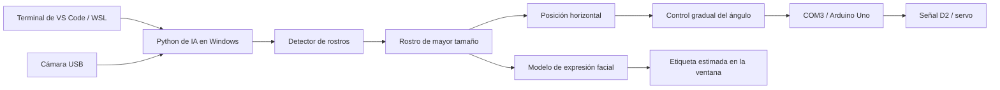

# Cámara USB, detección de rostro y servo con Arduino

Este proyecto conecta una cámara USB con los modelos de `emotion-detector` y
un servomotor controlado por Arduino Uno. Python detecta rostros en la imagen,
muestra una estimación de expresión facial y envía un ángulo al servo según la
posición horizontal del rostro seleccionado.

El código se trabaja desde VS Code / Ubuntu WSL en `/home/tucu/yo/camera`.
La cámara y el Arduino están conectados por USB a Windows, donde se ejecuta el
acceso a los dispositivos. No hace falta abrir Arduino IDE para el uso diario.

**Estado documentado: 12 de septiembre de 2026.** La integración llegó a abrir
la cámara, cargar los modelos y enviar órdenes al servo a partir de un rostro
detectado. Este README registra lo construido y comprobado hasta ese punto;
no indica que la aplicación permanezca ejecutándose en todo momento.

## Ejecutar la integración

El arranque recomendado prepara las variables, verifica las dependencias e
inicia la integración en una sola ejecución desde WSL:

```bash
cd /home/tucu/yo/camera
./start.sh
```

También funciona desde cualquier carpeta con `/home/tucu/yo/camera/start.sh`.
El script requiere Python 3.12 ya instalado en Windows, interoperabilidad de WSL
habilitada y el firmware USB del Arduino cargado. Crea el entorno de IA si falta
e instala las versiones requeridas cuando faltan o difieren. Comprueba además
la consistencia de las dependencias con `pip check`. Si todo coincide, no realiza
una instalación ni consulta el índice de paquetes.

El lanzador detecta las rutas de Python, exporta `ARDUINO_WINDOWS_PYTHON` y
`CAMERA_AI_PYTHON`, activa `perip/.venv` y pasa la cámara y el puerto al programa.
Si falta el entorno de WSL, crea uno con la biblioteca estándar; las dependencias
de IA y USB se ejecutan en el entorno de Windows. No es necesario ejecutar
`source` manualmente para usar `start.sh`.

Para cambiar la configuración predeterminada, copia `.env.example` a `.env`
junto al script y edítalo. Es opcional: por defecto usa `USB 2.0 CAMERA`, COM3 y
el sentido normal del servo. `.env` usa sintaxis de Bash y queda excluido de Git.

```bash
./start.sh --check                    # Entorno y modelos; no abre dispositivos
./start.sh --setup-only               # Solo preparar y verificar dependencias
./start.sh --no-servo --seconds 10     # Cámara e IA durante diez segundos
./start.sh --face-only --reverse      # Rostro y servo en sentido inverso
./start.sh --port COM4 --index 2      # Elegir dispositivos explícitamente
```

Las opciones de dispositivo de la línea de comandos prevalecen sobre los
valores de `.env`. `CAMERA_REVERSE=1` activa la inversión; usa `0` para el sentido
normal. `--check` verifica los modelos, pero no prueba la conexión física de los
dispositivos: esta se realiza al arrancar la aplicación.

La aplicación se ejecuta en primer plano con una ventana, no como un servicio
automático al iniciar Windows. El lanzador evita dos ejecuciones simultáneas de
`start.sh`. No detiene otras aplicaciones que ocupen la cámara o COM3 ni vuelve a
cargar el firmware automáticamente.

Se abre una ventana de Windows con el video, los rostros detectados, la etiqueta
estimada del modelo y el ángulo solicitado al servo. Cierra antes cualquier
otra vista de la misma cámara, demo del servo o monitor serie que use COM3.

| Control | Acción |
| --- | --- |
| Espacio | Pausar o reanudar el control del servo |
| Q o Esc | Cerrar la aplicación y liberar el servo |
| Cerrar la ventana | Finalizar la sesión |
| Ctrl+C en la terminal | Solicitar la parada desde WSL |

También se puede iniciar desde la raíz con
`python3 emotion-detector/run_camera.py`. Para esta integración se usa ese
punto de entrada o `perip/tracking.py`; el `main.py` original del repositorio
externo se conserva como referencia.

## Función de cada carpeta

| Carpeta | Función y contenido |
| --- | --- |
| [`digram/`](digram/) | Documentación del montaje: diagrama PDF, imagen del circuito y lista de componentes `bom.csv`. El nombre de la carpeta se conserva tal como se creó. |
| [`servo_60_grados/`](servo_60_grados/servo_60_grados.ino) | Sketch de referencia para Arduino IDE: alterna automáticamente entre 0° y 60° usando D2. Sirve para una prueba independiente de Python. |
| [`arduino/`](arduino/README.md) | Controlador USB original en Python, firmware que recibe órdenes, dependencias y script de compilación/carga `upload.ps1`. Es la base del control manual y automático del servo. |
| [`perip/`](perip/README.md) | Punto de entrada central para cámara, servo e integración con IA; contiene lanzadores, instaladores, lógica de movimiento y pruebas. |
| [`emotion-detector/`](emotion-detector/README.md) | Repositorio externo clonado en la rama `dev`, con modelos de rostro y expresión facial. Incluye la adaptación local para reutilizarlos desde `perip`. |

Dentro de `perip/`:

| Archivo o carpeta | Responsabilidad |
| --- | --- |
| `camera.py` | Listar cámaras, abrir video y guardar una foto; selecciona la USB por nombre. |
| `servo.py` | Reutilizar `arduino/servo.py` desde esta carpeta, sin duplicar el controlador. |
| `tracking.py` | Coordinar cámara, detección, visualización, selección del rostro y comunicación con Arduino. |
| `tracking_control.py` | Decidir los ángulos, los límites, la frecuencia de cambios y la parada al perder el rostro. |
| `windows_ai.py` | Localizar el Python de IA instalado en el disco de Windows. |
| `check_requirements.py` | Comprobar las versiones instaladas sin importar TensorFlow ni consultar la red; lo utiliza `start.sh`. |
| `setup.py` / `setup_ai.py` | Preparar los entornos de cámara/control básico y de IA, respectivamente. |
| `test_tracking_control.py` | Pruebas de la lógica del servo sin activar hardware. |
| `captures/` | Fotos guardadas por `camera.py`; excluidas de Git. |

Dentro de `emotion-detector/`, `face_detector/` contiene el detector Caffe y
`model/` contiene la arquitectura JSON y los pesos HDF5 del clasificador.
`detector.py` carga estos recursos mediante rutas independientes del directorio
desde el que se ejecuta el programa. `requirements-windows.txt` fija las
dependencias de la integración actual.

Las carpetas ocultas `.git/`, `.agents/` y `.codex/` corresponden a metadatos de
versionado o del entorno de trabajo; no forman parte del flujo de los dispositivos.
En la raíz, `start.sh` coordina el arranque y `.env.example` documenta las
variables de configuración opcionales.

## Cómo se llegó hasta aquí

1. **Prueba autónoma con Arduino IDE.** Se partió de un montaje que movía el
   servo mediante la biblioteca `Servo`, con señal en D2. Además del sketch
   local de 60°, el sketch usado en Windows (`sketch_sep12a`) alternaba 0° y 90°.
2. **Migración del control a Python.** Se creó el firmware `servo_usb`, que
   recibe comandos por el puerto serie, y `arduino/servo.py`, que permite
   comprobar la conexión, solicitar un ángulo y ejecutar ciclos. Se mantuvo D2.
3. **Diagnóstico del servo inmóvil.** Arduino confirmaba órdenes y parpadeaban
   sus luces, pero no había movimiento. Se volvió a cargar el programa autónomo
   que antes funcionaba y tampoco movió el motor. El usuario reconectó el cable
   que va al servomotor y confirmó que volvió a funcionar. Las respuestas `OK`
   y las luces, por sí solas, no demostraban movimiento físico. También hubo
   fallos de apertura de COM3 que se trataron como problemas de conexión USB.
4. **Restauración del firmware para Python.** Terminada la prueba autónoma, se
   volvió a cargar y verificar el firmware USB. El servo quedó disponible para
   recibir órdenes de Python, sin repetir movimientos por su cuenta al iniciar.
5. **Centralización de los periféricos.** Se creó `perip/` como acceso común y
   se añadió la cámara USB. Windows detectó `HP HD Camera`, `Camo` y
   `USB 2.0 CAMERA`; se seleccionó esta última por nombre para evitar depender
   de un índice fijo.
6. **Incorporación del repositorio de IA.** Se clonó
   [PLINIORZAVALA/emotion-detector](https://github.com/PLINIORZAVALA/emotion-detector)
   dentro de la raíz, usando `dev`, a partir del commit `1c53018`. Se reutilizaron
   sus modelos existentes; no se entrenó un modelo nuevo. Las adaptaciones se
   realizaron localmente sobre esa rama.
7. **Adaptación a Windows y WSL.** El modelo serializado usa Keras 2. Se preparó
   un entorno compatible con Python 3.12, TensorFlow 2.16.2 y `tf-keras` 2.16.0.
   La carga de bibliotecas desde la carpeta compartida de WSL resultó lenta, por
   lo que el entorno de IA se instaló en el disco local de Windows. HDF5 también
   falló al bloquear el archivo de pesos en la carpeta compartida: ahora se
   carga una copia temporal local, sin modificar los pesos originales.
8. **Conexión entre rostro y servo.** Se añadió la selección del rostro de mayor
   tamaño, el cálculo del ángulo horizontal y el envío de órdenes a COM3. La
   prueba integrada detectó un rostro, recibió confirmaciones para 45° y 50° y
   recibió `OK STOP` al perder la detección.

## Cómo funciona actualmente



La posición horizontal se transforma en un objetivo dentro del rango probado:
izquierda → 0°, centro → 45° y derecha → 90°. El controlador requiere tres
detecciones consecutivas, limita los cambios a 5° con al menos 150 ms entre
órdenes y evita ajustes menores de 3° mientras el servo está activo. Si deja de
detectar rostros durante un segundo, envía `STOP` y libera el servo. El comando
`--reverse` invierte la dirección.

La etiqueta de expresión facial es una estimación del modelo. No mide el estado
emocional de la persona y no se utiliza para decidir el movimiento del servo.

## Configuración y entornos

| Elemento | Configuración utilizada |
| --- | --- |
| Placa | Arduino Uno, conectado por USB a Windows |
| Servo | SG90; señal en D2; montaje documentado con 5V y GND |
| Puerto serie | COM3, 115200 baudios |
| Cámara externa | `USB 2.0 CAMERA`; índice 2 durante las pruebas |
| Imagen comprobada | 640 × 480 píxeles |
| Plataforma | Windows con Ubuntu WSL y Python 3.12 en los entornos configurados |
| Firmware activo al completar la integración | `arduino/firmware/servo_usb/servo_usb.ino` |

| Entorno | Uso |
| --- | --- |
| `arduino/.venv/` | Entorno de la primera etapa del controlador del servo; se conserva. |
| `perip/.venv/` | Entorno de WSL para los comandos de cámara y servo. |
| `perip/.venv-win/` | Python de Windows con OpenCV para la cámara básica. |
| `%LOCALAPPDATA%\camera-ai\venv` | Entorno activo de IA en el disco local de Windows. En este equipo: `C:\Users\User\AppData\Local\camera-ai\venv`. |
| `perip/.venv-ai/` | Entorno de IA creado durante las primeras pruebas en WSL; permanece en disco, pero el lanzador actual usa el entorno local de Windows. |

Los entornos son generados, no código fuente. La cámara y el servo básicos
pueden ejecutarse por separado. `tracking.py` abre ambos dispositivos desde un
solo proceso de Windows; no necesita mantener otras demos abiertas ni utiliza
un servidor HTTP.

## Preparar o recrear la instalación

Esta configuración requiere Windows con Python 3.12, Ubuntu WSL con Python y
`venv` o `uv`, y el repositorio `emotion-detector` como carpeta hermana de
`perip`. Para compilar el firmware se utiliza `arduino-cli` de la instalación
de Arduino IDE, con la plataforma AVR y la biblioteca Servo ya disponibles.

```bash
cd /home/tucu/yo/camera/perip
python3 setup.py
python3 setup_ai.py
source .venv/bin/activate
python tracking.py --check-models
```

Los instaladores descargan dependencias. `ARDUINO_WINDOWS_PYTHON` permite
seleccionar el Python base de Windows y `CAMERA_AI_PYTHON` permite indicar otro
ejecutable para IA; desde WSL se usan rutas del tipo `/mnt/c/.../python.exe`.

El firmware no se carga de nuevo en cada ejecución. Si se reemplazó por otro
sketch, sigue la sección de [carga de firmware](arduino/README.md#cargar-firmware-desde-la-terminal).
Cargar el sketch autónomo de `servo_60_grados/` sustituye el protocolo USB y
requiere restaurar `servo_usb` para volver a usar Python.

## Comandos de uso y diagnóstico

Ejecuta los siguientes comandos desde `perip/`, tras activar `.venv`:

```bash
# Cámara sin IA ni servo
python camera.py --list
python camera.py
python camera.py --check
python camera.py --snapshot captures/foto.jpg

# Servo manual: usar un comando cada vez
python servo.py --port COM3 --check
python servo.py --port COM3 --demo --cycles 3
python servo.py --port COM3 --angle 90

# Integración: elegir el modo necesario
python tracking.py
python tracking.py --no-servo
python tracking.py --face-only
python tracking.py --reverse
python tracking.py --seconds 30
```

En la cámara básica, **S** guarda una foto y **Q/Esc** cierra la ventana. Un
comando manual `--angle` mantiene la orden un segundo y después libera el servo.
`source .venv/bin/activate` solo activa el entorno: por sí solo no abre la cámara
ni mueve el motor.

## Qué se comprobó hasta este punto

| Prueba | Resultado observado |
| --- | --- |
| Montaje del servo | El usuario confirmó movimiento físico después de reconectar el cable del servomotor. |
| Control USB | Se cargó y verificó el firmware; Arduino respondió a `PING`, `SET` y `STOP`. |
| Cámara externa | Se recibieron 30 fotogramas de 640 × 480, se abrió video y se guardó una foto de prueba. |
| Modelos de IA | Cargaron el detector de rostros y los pesos del clasificador; una inferencia de comprobación produjo siete salidas finitas. |
| Integración real | Hubo detección de rostro y confirmaciones `OK 45`, `OK 50` y `OK STOP` desde Arduino. |
| Lógica del servo | Pasaron cinco pruebas automatizadas: detección sostenida, límites y pasos, pérdida/reaparición, inversión y rangos inválidos. |

Para repetir las pruebas de lógica sin cámara ni Arduino:

```bash
cd /home/tucu/yo/camera
perip/.venv/bin/python -m unittest discover -s perip
```

## Alcance actual y trabajo pendiente

La integración actual corresponde a una cámara fija que determina la posición
del servo. Todavía no implementa el control para mantener un rostro centrado
cuando la propia cámara está montada sobre ese servo, ni seguimiento vertical.
Si aparecen varias caras, selecciona la de mayor tamaño; no mantiene una
identidad entre fotogramas.

Las confirmaciones serie demuestran que Arduino procesó la orden, no que midió
el giro del eje. Queda pendiente comprobar y calibrar físicamente el movimiento
durante el seguimiento integrado, incluyendo el sentido y el rango según el
montaje definitivo. Tampoco se ha medido la precisión del clasificador de
expresiones en las condiciones reales de uso.

Para más detalle, consulta [periféricos e integración](perip/README.md),
[control y firmware del servo](arduino/README.md) y
[repositorio de IA](emotion-detector/README.md).
