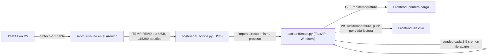

# iot/ — Arduino, sensores, cámara y visión

Todo lo que habla directamente con hardware: el Arduino Uno (servo, relé de luz,
sensor de sonido, sensor DHT11) y la cámara USB con los modelos de visión. Se
divide en cinco carpetas, cada una con una responsabilidad y un runtime propio:

| Carpeta | Qué es | Dónde corre |
| --- | --- | --- |
| [`firmware/`](#firmware-servo_usb) | Código embebido del Arduino Uno | En la placa (AVR) |
| [`firmware-tests/`](#firmware-tests) | Pruebas de esa lógica, sin placa | PC, `g++` |
| [`host/`](#host) | Puente USB: habla el protocolo serie con el Arduino | Windows (necesita abrir el puerto COM) |
| [`diagnostics/`](#diagnostics) | Scripts de verificación de hardware, sin cámara | Windows, vía `host/` |
| [`tracking/`](#tracking) | Cámara + IA + decisión de ángulo/luz | Windows, orquestado desde WSL por `start.sh` |

No hace falta abrir Arduino IDE para nada de lo anterior: `host/upload.ps1`
compila y carga con `arduino-cli` desde la terminal.

## Mapa de pines

Definido una sola vez en [`firmware/servo_usb/pins.h`](firmware/servo_usb/pins.h)
para que ningún módulo nuevo choque con uno existente (esto es justo lo que
falló dos veces al conectar el DHT11: primero se probó en D0, el pin RX del
puerto serie, y luego en D2, el del servo):

| Pin | Señal | Módulo del firmware |
| --- | --- | --- |
| D0 / D1 | Reservados por `Serial` (USB) | — nunca asignar |
| D2 | Servo SG90, PWM | `servo_control.h` |
| D3 | Relé de luz, activo en HIGH | `relay_light.h` |
| D4 | Sensor de sonido, salida digital DO | `sound_sensor.h` |
| D5 | DHT11 (temperatura + humedad), un solo cable | `dht11_sensor.h` |

## `firmware/servo_usb/`

Un archivo por componente físico; `servo_usb.ino` solo arma el protocolo serie
y llama a cada módulo.

| Archivo | Contenido |
| --- | --- |
| `servo_usb.ino` | `setup()`/`loop()`, el parser de comandos ASCII (`PING`, `SET`, `STOP`, `LIGHT ...`, `SOUND ...`, `TEMP READ`) y la instancia de cada clase de componente. |
| `pins.h` | Mapa único de pines (tabla de arriba). |
| `servo_control.h` | Clase `ServoControl`: `attach`/`write`/`detach` del servo en D2, con el LED integrado como indicador visual. |
| `relay_light.h` | Clase `LightControl`: temporizador de encendido del relé D3; la cámara (`LIGHT PERSON`) y el sonido comparten el mismo temporizador. |
| `sound_sensor.h` | Clase `SoundGesture`: reconoce una palmada (enciende) y tres palmadas seguidas (apagan) a partir de flancos en D4. |
| `dht11_sensor.h` | Clase `DHT11Sensor`: lee el protocolo de un solo cable del DHT11 a mano, sin librerías externas. No leer más rápido que cada ~2 s. |

Protocolo serie — 115200 baudios, líneas ASCII terminadas en `\n`:

| Orden | Respuesta | Qué hace |
| --- | --- | --- |
| `PING` | `PONG SERVO_USB_1` | Confirma que el firmware responde |
| `SET <0..180>` | `OK <ángulo>` / `ERR ANGLE` | Mueve el servo D2 |
| `STOP` | `OK STOP` | Libera el servo (dejar de sostener la posición) |
| `LIGHT PING` | `OK LIGHT_1` | Confirma que el firmware trae el control de luz |
| `LIGHT PERSON` | `OK LIGHT PERSON` | Renueva el temporizador de la luz (lo manda la cámara) |
| `LIGHT HOLD <1..3600>` | `OK LIGHT HOLD <s>` / `ERR HOLD` | Segundos que el relé queda encendido tras la última señal |
| `LIGHT STATE` | `OK LIGHT ON` / `OK LIGHT OFF` | Estado lógico actual del relé |
| `SOUND READ` | `OK SOUND HIGH` / `OK SOUND LOW` | Nivel crudo de D4 |
| `SOUND STATS` | `OK SOUND <eventos> <triples>` | Contadores de palmadas y de triples, llevados por el propio Arduino |
| `SOUND CHANGE` / `SOUND OFF` / `SOUND LOW` / `SOUND HIGH` | `OK ...` | Modo de lectura del sensor de sonido |
| `TEMP READ` | `OK TEMP <°C> <%HR>` / `ERR TEMP` | Lee el DHT11 en D5 |

## `firmware-tests/`

| Archivo | Contenido |
| --- | --- |
| `test_light.cpp` | Incluye `servo_usb.ino` directamente y lo compila como C++ de escritorio, con `digitalWrite`/`digitalRead`/`pinMode`/`millis`/`micros`/`delay` simulados. Cubre el temporizador de luz, el gesto de sonido, el protocolo serie y el envolvimiento del reloj (`millis()` desbordando). No ejercita el DHT11 (requeriría simular los tiempos del protocolo bit a bit); solo garantiza que compila. |
| `Servo.h` | Reemplazo mínimo de la librería `Servo` para el build de escritorio. |

```bash
g++ -std=c++11 -Wall -Wextra -Werror -I iot/firmware-tests iot/firmware-tests/test_light.cpp -o /tmp/camera_test_light
/tmp/camera_test_light
```

## `host/`

El único lugar que abre el puerto COM. Corre con el Python de **Windows**
porque el acceso USB nativo no está expuesto a WSL en este equipo.

| Archivo | Contenido |
| --- | --- |
| `serial_bridge.py` | Clase `USB` (abre el puerto, manda comandos, espera la respuesta esperada por comando), clase `WindowsBridge` (para cuando el proceso que la usa corre en WSL: lanza este mismo archivo como subproceso de Windows y habla con él por stdin/stdout) y una CLI (`--check`, `--angle`, `--demo`, `--port`). Es el módulo que `iot/diagnostics/`, `iot/tracking/tracking.py` y `backend/main.py` importan — **nadie más reimplementa el protocolo serie**. |
| `upload.ps1` | Copia los 6 archivos de `firmware/servo_usb/` a una carpeta temporal de Windows, compila con `arduino-cli` para `arduino:avr:uno` y carga (o solo compila con `-CompileOnly`). No abre la interfaz de Arduino IDE. |

```bash
# Comprobar el firmware sin mover el servo, desde WSL con el puente a PowerShell:
cd iot/host
/mnt/c/Windows/System32/WindowsPowerShell/v1.0/powershell.exe -NoProfile -ExecutionPolicy Bypass -File "$(wslpath -w "$PWD/serial_bridge.py")" --port COM6 --check

# Cargar firmware nuevo:
/mnt/c/Windows/System32/WindowsPowerShell/v1.0/powershell.exe -NoProfile -ExecutionPolicy Bypass -File "$(wslpath -w "$PWD/upload.ps1")" -Port COM6
```

El puerto COM **cambia entre sesiones** (ha sido COM3 y COM6 en este equipo).
Revísalo con `Get-CimInstance Win32_SerialPort` antes de asumirlo.

## `diagnostics/`

Scripts de verificación puntual, sin cámara ni servo — para aislar si un
problema es del sensor, del cableado o del firmware.

| Archivo | Contenido |
| --- | --- |
| `check_sound.py` | Registra cambios de nivel en D4, el contador de palmadas del propio Arduino y los cambios de estado de D3 durante N segundos. |
| `check_temp.py` | Pide `TEMP READ` cada 2 s durante N segundos y reporta `ok`/`ERR TEMP` — el mismo mecanismo que usa el backend. |

```bash
cd iot/diagnostics
python check_temp.py --port COM6 --seconds 20
```

(Se ejecutan con el Python de Windows, igual que `host/`, porque importan
`serial_bridge.USB`.)

## `tracking/`

Cámara + modelos de IA + decisión de ángulo y luz. Es lo que arranca
`start.sh` desde la raíz del proyecto.

| Archivo | Contenido |
| --- | --- |
| `tracking.py` | Punto de entrada: abre la cámara, corre ambos detectores, elige el objetivo, calcula el ángulo, manda `LIGHT PERSON`/`SET`/`STOP` al Arduino vía `host/serial_bridge.py`, dibuja la ventana. |
| `tracking_control.py` | Lógica pura (sin hardware): `FaceServo` decide el ángulo con suavizado, `PresenceLight` decide cuándo mandar `LIGHT PERSON`, `select_target` elige rostro > persona. |
| `camera.py` | Listar cámaras, ver video en vivo, guardar una foto; selecciona la cámara USB por nombre o índice. |
| `human_detector.py` | Adaptador de MobileNet-SSD (pesos en `ai/comp_vision/human-detector/`); filtra la clase VOC 15 (persona) con confianza ≥ 0.5. |
| `windows_ai.py` | Ubica el Python de IA en el disco de Windows (`%LOCALAPPDATA%\camera-ai\venv`). |
| `check_requirements.py` | Compara versiones instaladas contra las fijadas, sin importar TensorFlow ni tocar la red; lo usa `start.sh`. |
| `setup.py` | Crea `.venv` (WSL) y `.venv-win` (Windows, cámara básica con OpenCV). |
| `setup_ai.py` | Crea el entorno de IA de Windows e instala `ai/comp_vision/emotion-detector/requirements-windows.txt`. |
| `test_tracking_control.py` / `test_human_detector.py` | Pruebas sin hardware de la lógica de ángulo y del adaptador de personas. |
| `captures/` | Fotos guardadas por `camera.py`; excluida de Git. |

El modelo de expresiones y el detector de rostro Caffe viven fuera de `iot/`,
en [`ai/comp_vision/emotion-detector/`](../ai/comp_vision/emotion-detector/) —
`tracking.py` los carga por ruta absoluta, no los duplica.

## Cómo esto alimenta al backend en tiempo real

El dashboard web (`../backend/`, `../frontend/`) no le habla al Arduino
directamente: reutiliza **el mismo `host/serial_bridge.py`** que usan
`diagnostics/` y `tracking/`, para no tener una segunda implementación del
protocolo serie.



En concreto (`backend/main.py`):

1. Al arrancar, `USB(os.environ["ARDUINO_PORT"])` abre el puerto COM una vez
   (autodetecta si no se define `ARDUINO_PORT`) — igual que hace
   `diagnostics/check_temp.py`.
2. Una tarea `asyncio` de fondo llama `usb.request("TEMP READ")` cada 2.5 s
   **en un hilo separado** (`run_in_executor`), porque pyserial bloquea y no
   se puede llamar directo desde el loop de eventos de FastAPI.
3. Cada lectura se guarda como último valor y se agrega a un historial en
   memoria (tope 120 muestras, ~5 minutos).
4. La misma lectura se reenvía por `WebSocket` a cada cliente conectado en
   `/ws/temperature`; el frontend también puede pedir `GET /api/temperature`
   o `GET /api/temperature/history` en cualquier momento.

Por eso el backend **tiene que correr con el Python de Windows** (como
`host/` y `diagnostics/`): es el único que puede abrir el puerto COM
directamente en este equipo. El frontend, en cambio, puede servirse desde
WSL sin problema — solo consume HTTP/WebSocket.

Un efecto práctico: mientras el backend está corriendo, tiene el puerto COM
abierto en exclusiva. No se puede correr `tracking.py` ni un diagnóstico al
mismo tiempo contra el mismo Arduino — closer el backend primero.

## Incidencias conocidas de esta carpeta

- **El puerto COM cambia entre sesiones** (COM3 → COM6 visto en este equipo).
  Ningún script lo asume fijo salvo el valor por defecto `COM3` en los `--port`;
  siempre verificar con `Get-CimInstance Win32_SerialPort` antes de una prueba.
- **El enlace serie corrompe datos ocasionalmente**: de 600 `PING`
  consecutivos, 3 recibieron `ERR COMMAND` (0.5 %). Sospecha: a 16 MHz el UART
  del Uno genera ~117 647 baudios reales frente a los 115 200 nominales
  (+2.1 % de error). Pendiente de decidir si bajar a 57600 baudios.
- **El sensor de sonido en D4 puede quedar sin señal** si el módulo pierde
  alimentación o el cable sale de AO en vez de DO. Prueba definitiva: tocar D4
  con un cable a GND y ver si `SOUND STATS` incrementa el contador.
